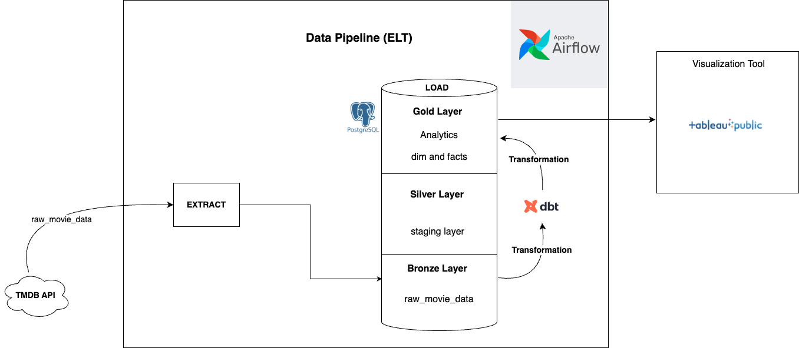

# Movie Data Engineering Project
This repository demonstrates a complete **Data Engineering Pipeline** that **extracts, loads and transforms (ELT)** movie data from **The TMDB API** into PostgreSQL database and then models the data using **DBT** for analysis and visualizes using **Tableau Public**.

## Project Overview

The project is divided into three main parts:

1. **ETL Pipeline**:
    - **Extract**: Movie data is fetched from the **TMDB API** from different endpoints.
    - **Load**: The raw data from the API is directly loaded into **PostgreSQL** database.
    - **Transform**: The raw data is then cleaned, transformed and modeled using **dbt(data build tool)** for further analytical purpose.

2. **Data Modeling using dbt**:
    - The raw data stored in PostgreSQL is cleaned, transformed and structured using **dbt**. The process follows the **Medallion Architecture** of data modeling, which organizes data into three layers(Bronze, Silver and Gold Layer).
        - **Bronze Layer** : Raw data is ingested into the system with inconsistencies, missing values, and stored in PostgreSQL without any transformation.
        - **Silver Layer** : Data in the bronze layer is cleaned and then standarized by handling all the missing values, generating surrogate keys through different staging layers.
        - **Gold Layer** : In this Layer, the data from silver layer is structured into **facts** and **dimension** following **Kimball's Data Modeling Principle**.
            - **Fact Tables**: These focuses on quantitative data, such as vote counts.
            - **Dimension Tables**: These contain all the descriptive data such as movie language, description, release dates and so on.

3. **Data Visualization**:
    - The transformed data is visualized using **Tableau  Public** for better insights and analysis.

### Data Visualization


### Data Architecture



#### Why This Architecture?

I chose this architecture because it follows best practices for building scalable and efficient data pipelines. Instead of traditional **ETL** approach, I implemented **ELT** paradigm, using **dbt(data build tool)** for transformation.

- **ELT with Medallion Architecture** : Data is first extracted from TMDB API from different endpoints and loaded into PostgreSQL(BRONZE LAYER). This ensures data integrity and flexibility.
- **Transformations using dbt** : Data is then cleaned and structured within the PostgreSQL following data modeling principles.
- **Star Schema for Analytics** : The final transformed data is organized into fact and dimension tables, making it easy to use for BI tools.
- **Visualization with Tableau** : The processed data is sent to Tableau Public for reporting and insights.

This architecture ensures scalability and high performance and follows best practices used in real-world data engineering.

## Prerequisites

Before running the project, ensure that you have the following setup.
1. Clone both the ```the_movies-db``` and ```dbt_movie_db``` repositories into your local machine.

    ```bash
    git clone https://github.com/tsandil/the_movies_db.git
    git clone https://github.com/tsandil/dbt_movie_db.git
    cd the_movies_db
    ```
1. **PostgreSQL Database** : Ensure PostgreSQL is installed and running.
2. **Airflow** : Apache Airflow is used for Orchestration.
    - Install Airflow with [PYPI](https://airflow.apache.org/docs/apache-airflow/stable/installation/installing-from-pypi.html)

3. **Docker** : Docker is required to run Airflow in a containerized environment.
    - Install Docker from [here](https://www.docker.com/get-started).

4. **Python Libraries** : The following libraries has been used
- ```requests```
- ```pandas```
- ```sqlalchemy```
- ```json```
- ```airflow```
- ```PostgresHook``` from ```airflow.providers.postgres```
- **Install Dependencies** : ```pip install -r requirements.txt```

5. **dbt (Data Build Tool)** : Install dbt to run data transformation models:
    ```bash
    pip install dbt
    ```

## How to Run This Project

1. Configuration

    1. **API Key** : Add your TheMovieDB API key as an Airflow variable named ```the_moviedb_auth_key``` in Airflow's Admin > Variables.

    2. **PostgreSQL Connection** : Set up a PostgreSQL connection in Airflow with the connection ID ```themovies_con```.
        - host: `host.docker.internal` if running from local machine
        - database: `your_database`

    3. Start Airflow

        1. **Initialize the Project**:
            ```bash
            astro dev init
            ```

        2. **Start the Project**:
            ```bash
            astro dev start
            ```

        3. **Access the Airflow Web UI**:
            Go to `http://localhost:8080` and use default credentials:
            - **Username**: `admin`
            - **Password**: `admin`
        
        4. **Trigger the DAG** : Once Airflow is running, trigger the DAG from the Airflow UI to begin the ETL process.

        5. **Run dbt Models** : After the DAG completes, run your DBT models to transform the data
            ```bash
            dbt run
            ```


## Lessons Learned

Throughout this project, I gained a deeper understanding of the **ELT** paradigm, how **Data Modeling** and **Transformations** play a crucial role in analytics. Using **Medallion Architecture** and **Kimball's Principles**, I was able to structure and model data in a useful way. I also learned how to manage and orchestrate tasks with **Apache Airflow**, using parallel processing to handle multiple tasks efficiently.Handling data with **PostgreSQL** and **dbt** gave me valuable experience in managing and transforming large datasets.Additionally, I learned how important data visualization is for making insights more accessible.
If I had more time or resources, I would have focused on improving the ETL pipeline to handle larger datasets more efficiently and enhanced the data transformation process with dbt for deeper analytics. I would also consider using **Apache Spark** for better scalability. The tools I used, like **PostgreSQL, dbt, and Airflow**, were a great fit for the project, but with more time, I'd work on refining the visualizations and make the reports even more interactive.

## Contact

Please feel free to contact me if you have any questions at: LinkedIn
[LinkedIn](www.linkedin.com/in/sandil-tandukar-5b1259299/)